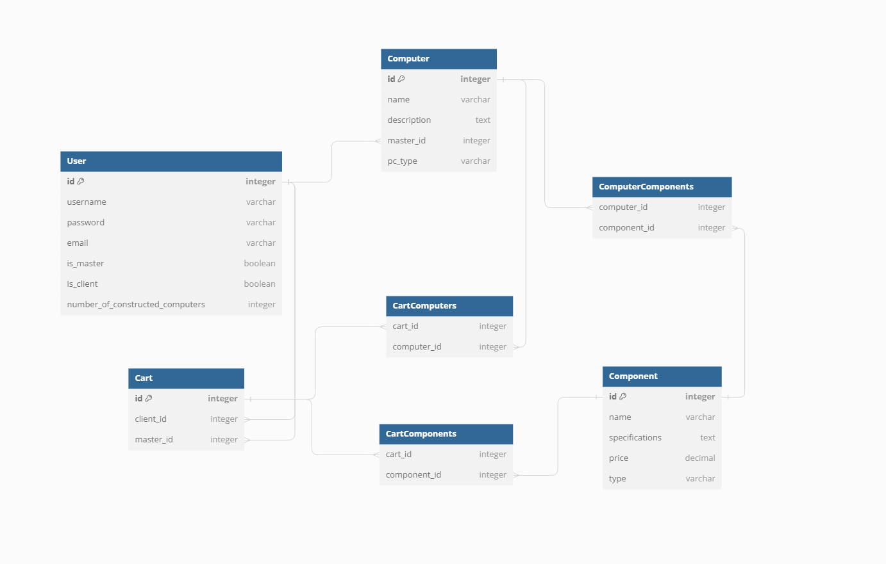

# Computer Workshop Application

## Overview

The Computer Workshop application is designed to manage and display custom-built PCs and their components. The application allows users to browse, search, filter, and sort through a collection of PCs and components. Additionally, it provides functionality for master users to create, edit, and delete PCs and components. The application also includes a configurator for custom PC builds and a homepage with statistical summaries.

## DB-structure diagram

## Models

### User

- `email`: Unique email address for the user.
- `is_master`: Boolean indicating if the user is a master.
- `is_client`: Boolean indicating if the user is a client.

### Component

- `name`: Name of the component.
- `specifications`: Detailed specifications of the component.
- `price`: Price of the component.
- `type`: Type of component (e.g., CPU, GPU, RAM, etc.).

### Master

- `user`: One-to-one relationship with the `User` model.
- `number_of_constructed_computers`: Integer field tracking the number of PCs constructed by the master.

### Client

- `user`: One-to-one relationship with the `User` model.

### Computer

- `name`: Name of the computer.
- `description`: Description of the computer.
- `components`: Many-to-many relationship with the `Component` model.
- `master`: Foreign key relationship with the `Master` model.
- `pc_type`: Type of PC (e.g., Gaming PC, Workstation, etc.).

### Cart

- `client`: One-to-one relationship with the `Client` model.
- `items`: Many-to-many relationship with the `Computer` model.

### Application Functionality Overview

The application provides a variety of functionalities for managing a computer workshop, including user management, component and computer management, custom PC configuration, and cart operations. Below is a description of each functionality.

#### Home View
- **Function**: Displays the homepage with counts of available computers, components, and masters.

#### Available Computers View
- **Function**: Lists all available computers with pagination and sorting options (by name, type, and price). Provides search functionality.

#### Computer Detail View
- **Function**: Displays detailed information about a specific computer.

#### User Authentication Views
- **Login**: Displays and processes the login form.
- **Register**: Displays and processes the registration form.

#### Configurator View
- **Function**: Allows users to configure a custom PC by selecting components and a master. Adds the configured components to the user's cart.

#### Add Computer View
- **Function**: Allows masters to add new computers to the system.

#### Available Components View
- **Function**: Lists all available components with pagination and sorting options (by name, type, and price). Provides search functionality.

#### Manage Users View
- **Function**: Allows superusers and masters to manage users. Provides search and filter functionality and displays a paginated list of users.

#### View User Cart View
- **Function**: Allows masters to view the cart of a specific client.

#### Component Management Views
- **Edit Component**: Allows masters to edit existing components.
- **Delete Component**: Allows masters to delete components.
- **Add Component**: Allows masters to add new components to the system.

#### Computer Management Views
- **Edit Computer**: Allows masters to edit existing computers.
- **Delete Computer**: Allows masters to delete computers.

#### Cart Management Views
- **Add Component to Cart**: Allows clients to add components to their cart.
- **Add Computer to Cart**: Allows clients to add computers to their cart.
- **View Cart**: Displays the contents of the client's cart.
- **Remove from Cart**: Allows clients to remove items from their cart.
- **Clear Cart**: Allows clients to clear all items from their cart.
- **Remove Master from Cart**: Allows clients to remove the master from their cart.

#### Edit User View
- **Function**: Allows superusers to edit user information.

## Future Development Prospects for the Computer Workshop Application

The Computer Workshop application has a solid foundation with its current features, but there are several areas where we can expand and improve the functionality and user experience. Here are some key prospects for future development:

#### 1. Performance Analytics Integration
When clients configure a PC using the configurator, the system can automatically fetch and display performance data based on the selected components. This can be achieved by parsing information from various benchmarking and review websites. Key metrics could include:
- Gaming performance (FPS in popular games)
- Productivity benchmarks (e.g., video rendering times, software compilation times)
- Power consumption and thermal performance

#### 2. Enhanced User Interface and User Experience
Improving the design and usability of the site will make it more engaging and easier to navigate. Potential enhancements include:
- Modernizing the UI with a more visually appealing design
- Implementing responsive design to ensure optimal performance on all devices
- Enhancing the configurator interface with real-time feedback and visual representation of the configured PC
- Adding drag-and-drop functionality for component selection

#### 3. Automated Compatibility Checks
Integrate a system that automatically checks for compatibility issues between selected components. This would help prevent configurations that won't work together, improving the user experience and reducing the likelihood of user error.

#### 4. User Reviews and Ratings

#### 5. Inventory Management
Add features for managing inventory levels of components and pre-built PCs. This can include:
- Stock level tracking
- Automated notifications for low stock
- Integration with suppliers for real-time stock updates

#### 6. Advanced Search and Filter Options
Enhance the search functionality with more advanced filters and sorting options, including:
- Filtering by performance metrics
- Sorting by popularity or user ratings
- Advanced keyword search with auto-suggestions
